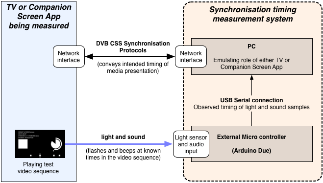

# DVB companion synchronisation timing accuracy measurement

**The code and hardware designs in this project form a system for measuring
how accurate synchronisation is for a device that implements the [DVB CSS
Specification](https://www.dvb.org/search/results/keywords/A167). This
specification defines protocols that enable synchronisation of media
presentation between a TV and Companion devices (mobiles, tablets, etc).**

* **[Overview](#overview)**
* **[Getting Started](#getting-started)**
* **[How does it work?](#how-does-the-measurement-system-work)**

This system can measure with approximately millisecond accuracy for
Companion Screen Applications (CSAs) and TV Devices.

*Update: Measurement of TV Devices has been added!*

*Very shortly we will be adding an example showing how to use the same
measurement back-end code to measure relative synchronisation between
audio and video. The explanations here cover all these situations.*

## Overview

The measurement system consists of:

* Python code running on a PC or laptop that emulates the role of either the
  TV Device or the CSA. 

* A microcontroller for measuring the timing of light and sound output from
  the device being measured.

* A test video sequence that the TV or CSA plays.

  

The PC code talks using the DVB protocols. If it is a TV Device being
measured, then it listens to the timings reported by the TV (the TV's claim
as to what presentation timing it is using). If it is a CSA being tested then
it instructs the CSA of what timings it should use.

An external microcontroller (an [Arduino
Due](http://arduino.cc/en/Main/arduinoBoardDue) ) samples the light and sound
from the device being tested and notes the precise timing of those samples.

The TV or Companion Screen Application must present a specific video test
sequence containing flashes and beeps at defined times. The flashes are
detected by a light sensor affixed to the display over the area of the image
that flashes. The audio output (or a microphone) feeds a line-level audio
input.

The microcontroller is told which light sensor and/or audio inputs should be
read during data capture. Once the microcontroller has collected samples over
a period of time, these are sent to the PC via a USB connection. Code on the
PC detects the flashes and beeps from the sample data and translates the
timings of the samples to that of the timeline used in the DVB
synchronisation protocols.

The PC can therefore match up the observed timings of flashes and beeps to
those that it expected for the video clip and determine how much they
differed from what was conveyed via the DVB protocols.

More information [on how the measurement system works.](docs/README.md) is in
the [README](docs/README.md) in the [docs](docs) folder.

## Getting started

The PC code is written primarily in Python 2.7 and will run under Windows,
Linux or Mac OS X. It requires [pydvbcss](https://github.com/BBC/pydvbcss),
[pyserial](http://pyserial.sourceforge.net/) and [pillow (a fork of
PIL)](https://pillow.readthedocs.org/) libraries.

The Arduino microcontroller code is written using Arduino's free IDE. This
IDE has built in support for uploading the code to the Arduino. The IDE also
runs on Windows, Mac and Linux.

### 1. Download this clode plus dependencies

**Clone the master branch of this code:**

    $ git clone https://github.com/bbc/dvbcss-synctiming.git

The [master branch](https://github.com/BBC/dvbcss-synctiming/tree/master) is the
latest state of the code, including any recent bug fixes and new features. It
will be kept stable (working). Alternatively you can download a [release
snapshot](https://github.com/BBC/dvbcss-synctiming/releases).

**Now lets also get the dependencies...**

On Mac OS X and Linux you may need to run one or more of the following
commands as root.

We recommend using [pip](https://pip.pypa.io/en/latest/installing.html) to
install pyserial and PIL (aka "pillow") from the Python Package Index
[PyPI](https://pypi.python.org/pypi):

    $ pip install pyserial 
    $ pip install pillow

Download and install [pydvbcss library](https://github.com/BBC/pydvbcss) from
GitHub (it is not yet available through PIP). This provides the
implementation of the DVB synchronisation protocols used by the PC software.

    $ git clone https://github.com/BBC/pydvbcss.git
    $ pip install cherrypy
    $ pip install ws4py
    $ cd pydvbcss
    $ python setup.py install

### 2. Create a video test sequence

Do this using the [video test sequence
generator](test_sequence_gen/README.md) that is included in this project.

The device being tested (TV Device or CSA) must play a video clip containing
suitable beeps and flashes at defined times. The measurement system needs
metadata (that is also created by the test sequence generator) so that it
knows what times the beeps and flashes occur at in the sequence.

### 3. Get an Arduino Due and assemble the sensor hardware

This project includes details of how to create the necessary
[sensor input hardware](hardware/README.md) for the Arduino microcontroller
and [install the arduino code](hardware/README.md)

When you are ready to make a measurement, connect it all up:

1. Affix the light sensor to the region of the display where the flashing
rectangular box from the test video sequence appears. Connect the light
sensor to light sensor input 0 of the Arduino circuit.

2. Connect the audio output of the TV/CSA to audio input 0 of the Arduino
circuit. You can also use a microphone (with line-level output) but this is
not recommended.

3. Make sure the screen brightness is reasonable and audio output is un-muted
and at a reasonable volume.

3. Connect the Arduino's "native" USB port to a USB port on the PC.

### 4. Decide what the TV or CSA is going to do

Prior making a measurement, the measurement system, and the system being
measured (the TV Device or CSA) must both agree on what timeline will be used
via the DVB CSS protocols (including agreeing its tick rate) and how it will
relate to the playing of the test video sequence.

**When measuring a TV Device** the measurement system will need to be told:
* what timeline it must request from the TV (timelineSelector value);
* the tick rate of that timeline;
* and what value of the timeline corresponds to the start of the video.

**When measuring a CSA** the measurement system and CSA will need to know:
* what timelineSelector is to be used;
* the tick rate of that timeline;
* and what value of the timeline should correspond to the start of the video.

In both cases, the measurement system also needs the metadata for the video
test sequence that tells it the timing of the flashes and beeps within the
sequence. This metadata is created automatically by the
[video test sequence generator](test_sequence_gen/README.md).

Finally, if a CSA is being measured, then the **CSA must report the
greatest Wall Clock dispersion during the measurement period** so this can be
taken into account by the measurement system.
 
*How to calculate dispersion is explained in Annex C.8 of the
[DVB CSS specification](https://www.dvb.org/search/results/only/standards/page/1/items/12/keywords/A167-2)*

(When the measurement system is measuring a TV Device, it is acting in the role
of the CSA and so will be able to observe its dispersion for Wall Clock
synchronisation itself)

### 5. Take a measurement

#### Taking a measurement a Companion Screen Application

*For this scenario, the measurement system will pretend to be the TV. The
Companion Screen Application will connect to the measurement system using the
DVB CSS protocols. The measurement system will pretend to have a timeline, and
will compare the timing information it sent to the CSA to the light and sound
that the CSA emits.*

1. Press the "RESET" button on the Arduino.

2. Start the measurement software by running
   [src/exampleCsaTester.py](src/exampleCsaTester.py) and configuring it using
   command line parameters. For example (split over multiple lines for ease of
   reading):

        $ python src/exampleCsaTester.py urn:dvbcss-synctiming:testvideo  \
                                   urn:dvb:css:timeline:pts 1 90000       \
                                   12345678                               \
                                   --addr 192.168.1.5                     \
                                   --light0 metadata.json                 \
                                   --audio0 metadata.json                 \
                                   --toleranceTest 8.0                    \
                                   --measureSecs 15
   
    This instructs the measurement system to:

     * Pretend to be a TV with content id of "urn:dvbcss-synctiming:testvideo"

     * ... and to provide a PTS timeline:
       * denoted by timeline selector value of "urn:dvb:css:timeline:pts"
       * with a tick rate of 1 unit per tick and 90000 units per second
         (meaning 90000/1 ticks per second)

     * ... emulating the role of the TV at 192.168.1.5, using defaults for port
       numbers:
       * CSS-CII: ws://192.168.1.5:7681/cii
       * CSS-TS: ws://192.168.1.5:7681/ts
       * CSS-WC: udp://192.168.1.5:6677

     * Assume the CSA will play the test sequence video such that the first
       frame of that video will be showing when the timeline position is
       12345678.

     * Measure the first light sensor (light sensor 0) and first audio input
       (audio input 0), and to compare both to the expected times of beeps
       and flashes in `metadata.json` (this file was created by the 
       [test video sequence generator](test_sequence_gen/README.md))
       
     * Report on whether the timing was accurate enough to be within a
       tolerance of +/- 8 milliseconds (after error bounds of measurement are
       taken into account)
   
     * Measure for only 15 seconds. If this option is omitted, the arduino
       measures until its memory buffer is full. See
       [this table](#measurement-period-duration). This number must be an
       integer number of seconds.
   
    (For more information on the command line arguments, use the `--help`
    option) 

3. Start the CSA and get it to synchronise with the measurement system.

    * The CSA needs to connect to the CSS-CII server being provided by
      the measurement system at the URL determined by the command line
      options, and then also use the CSS-TS and CSS-WC protocols.

4. Follow the instructions (displayed by the measurement system) to start
   taking the measurement.

Once measurement is complete, the program will ask for the 
greatest Wall Clock dispersion of CSA during the measurement period. The CSA
must output this information somehow.

The system will then display the results and exit. This includes details of
how good a match it found between the pattern of flashes and beeps it
expected and those that it observed. It also reports how far ahead or behind
the CSA appeared to be.

#### Taking a measurement of a TV Device

*For this scenario, the measurement system will pretend to be the Companion
Screen Application. It will connect to the TV using the DVB CSS protocols and
compare the timing information reported by the TV to the light and sound it
sees coming from the TV.*

1. Press the "RESET" button on the Arduino.

2. Start the TV Device playing the test video sequence.

3. Start the measurement software by running
   [src/exampleTVTester.py](src/exampleTVTester.py) and configuring it using
   command line parameters. For example (split over multiple lines for ease of
   reading):

        $ python src/exampleTVTester.py ""                                 \
                                        "urn:dvb:css:timeline:pts" 1 90000 \
                                        12345678                           \
                                        ws://192.168.1.23:7681/ts          \
                                        udp://192.168.1.23:6677            \
                                        --light0 metadata.json             \
                                        --audio0 metadata.json             \
                                        --toleranceTest 23.0		   \
                                        --measureSecs 15
   
    This instructs the measurement system to:

     * Pretend to be a CSA, connecting to:
       * a CSS-TS service at: ws://192.168.1.23:7681/ts
       * a CSS-WC service at 192.168.1.23 on port 6677
      
     * ... and to request (via CSS-TS) to synchronise to a PTS timeline:
       * denoted by timeline selector value of "urn:dvb:css:timeline:pts"
        * with a tick rate of 1 unit per tick and 90000 units per second
         (meaning 90000/1 ticks per second)
       * asking that the timeline be available from the TV irrespective
         of what content is showing
         (a contentIdStem of the empty string "" will match any content ID)

     * Assume the TV will play the test sequence video such that the first
       frame of that video will be showing when the timeline position is
       12345678.

     * Measure the first light sensor (light sensor 0) and first audio input
       (audio input 0), and to compare both to the expected times of beeps
       and flashes in `metadata.json` (this file was created by the 
       [test video sequence generator](test_sequence_gen/README.md))
       
     * Report on whether the timing was accurate enough to be within a
       tolerance of +/- 23 milliseconds (after error bounds of measurement
       are taken into account)

     * Measure for only 15 seconds. If this option is omitted, the arduino
       measures until its memory buffer is full. See
       [this table](#measurement-period-duration). This number must be an
       integer number of seconds.
   
    (For more information on the command line arguments, use the `--help`
    option) 

The measurement system will start, connect to the TV and immediately
begin measuring.

The system will then display the results and exit. This includes details of
how good a match it found between the pattern of flashes and beeps it
expected and those that it observed. It also reports how far ahead or behind
the CSA appeared to be.

## Measurement period duration

The system can measure until the 90 KByte buffer on the arduino is full.
For each input pin being measured, 2000 bytes of data are used every second.
The table below shows the maximum measurement periods allowed:

Number of light or sound input pins being measured | Maximum measurement duration possible
-------------------------------------------------- | -------------------------------------
1 | 45 seconds
2 | 22 seconds
3 | 15 seconds
4 | 11 seconds

**Remember** that length of the measurement period in seconds must be equal
to or greater than the sequence bit-length of the test video sequence.
For example: a measurement period of at least 7 seconds must be used for
a 7 bit sequence.

If the measurement period is too short then the system will sometimes fail
to correctly determine the synchronisation accuracy and will produce spurious
erroneous results.

## Assumptions

This measurement system makes various assumptions that must be taken into
consideration when making a measurement:

### Playback must be constant during measurement

During the period of measurement, the media playback should proceed at a
constant speed without pausing, or skipping forwards or backwards.

### The TV/CSA does not skip more than one or two frames when keeping in sync

The "flashes" and "beeps" detected by the measurement system are 3 frames in
duration. If the TV or CSA playing the test video sequence skips more than 1
or 2 consecutive frames then the "flashes" or "beeps" will not be detected.

### The display's light output does not toggle on/off repeatedly during a frame
### ...or has off-periods significantly shorter than 4 ms

Some display technologies modulate their light output (e.g. modulating the
backlight of an LCD panel). The algorithm that detects flashes will ignore
brief off periods during a flash of up to 4 sample periods (4 milliseconds).

If, during a frame containing a flash, the light output is modulated off for
4 milliseconds or longer then the algorithm will mistake this for the end of
the flash and the start of a new one.

### The light sensor does not pick up significant stray light
### The audio signal is free from background noise

The light sensor should be fixed as closely as possible to the display and,
ideally, enclosed to avoid too much stray light.

Similarly, the audio should be relatively free from interference. A direct
connection from an audio output is ideal. However, if a microphone is used,
then care is needed to ensure there is silence while measurements are being
taken. Note that the audio inputs are line-level, and so an un-powered
mic's output signal is unlikely to work unless it is amplified.

## How does the measurement system work?

There is an [explanation of how the measurement system works.](docs/README.md)
are in the [docs](docs) folder.

## Contact and discuss

Please get in touch with the authors to discuss or ask questions.

The original authors are:
* Jerry 'dot' Kramskoy 'at' bbc.co.uk
* Matt 'dot' Hammond 'at' bbc.co.uk

Because this code uses the [pydvbcss
library](https://github.com/BBC/pydvbcss), you can also discuss it at the
[pydvbcss google group](<https://groups.google.com/forum/#!forum/pydvbcss>).

## Licence

All code and documentation is licensed under the Apache License v2.0.

## Contributing

If you would like to contribute to this project, see
[CONTRIBUTING](CONTRIBUTING.md) for details.
