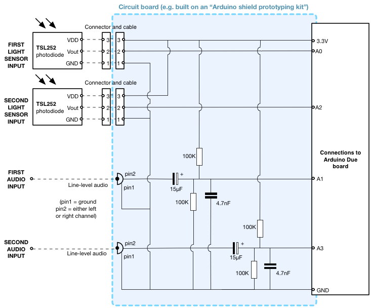
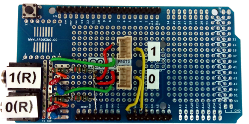

# Light/sound sampling hardware

An [Arduino Due](http://arduino.cc/en/Main/arduinoBoardDue) and some simple
electronics mounted on a daughter board (known in Arduino circles as a "shield")
are used to capture data from an audio output of the device being  tested and
from a light sensor attached to its display.

## 1. Build the circuit

The design here interfaces photodiodes directly to an analog input pin of
the Arduino, and channels from line level audio signals to other analog
input pins. This forms the light sensor and audio signal inputs.

There is a [list of parts](partslist.rst) for building this in prototype board
form. Here is an example of the circuit implemented on a shield prototyping kit
(with no apologies for the poor quality soldering!):

  

There are some connection wires on the rear of the board that cannot be seen
in this photo.

The connectors for attaching the light sensors (centre) and the 3.5mm audio
jack sockets (left side) are labelled. Only the right-audio channel is used
on the two audio inputs.

## 2. Upload code onto the Arduino Due board

To do this, you need to [install the free Arduino IDE](http://arduino.cc/en/Main/Software)
Make sure you have version 1.6 or later for Arduino Due support.

1. Open the `arduino_sampling_code.ino` project in the IDE

2. Plug the Arduino Due in via a USB cable connected to the "Programming" port.

3. From the menu in the IDE, make sure the correct *board type* and *port* are
selected.

4. Click the *compile+upload* icon.

Once the code is uploaded, it is stored in flash memory. It does not need to be
uploaded again, even if the Arduino is unplugged and powered off.

When using the Arduino with the rest of the measuring system, it should be
connected via the other USB port, labelled "native".

The main python timing measurement code will report an error if it is unable
to find a correctly connected Arduino.
